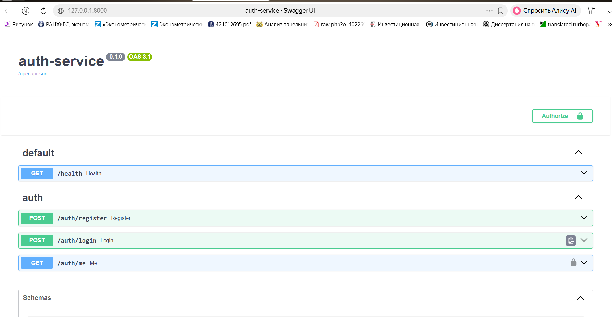
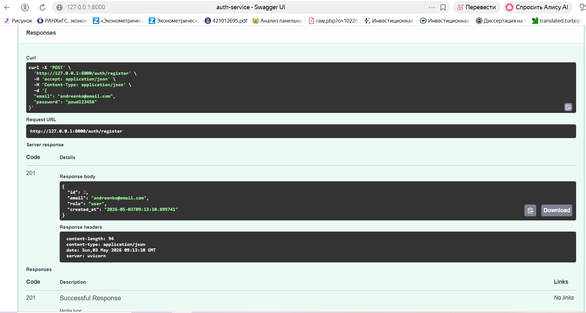
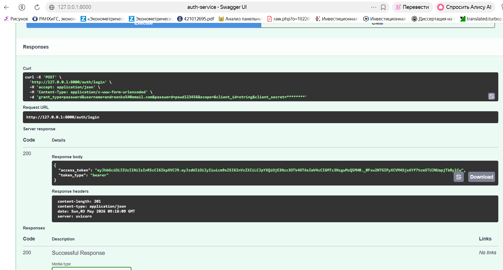
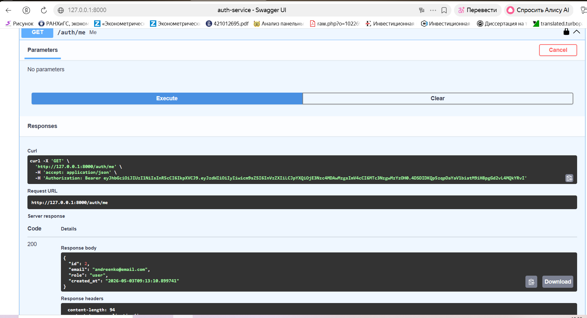
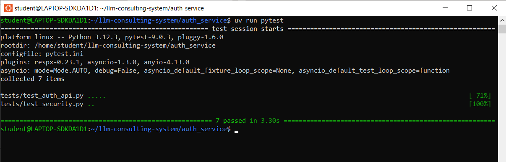
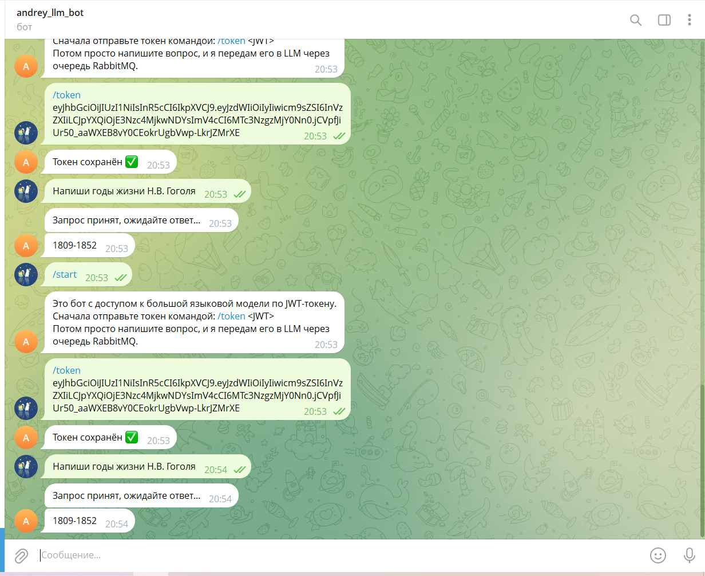
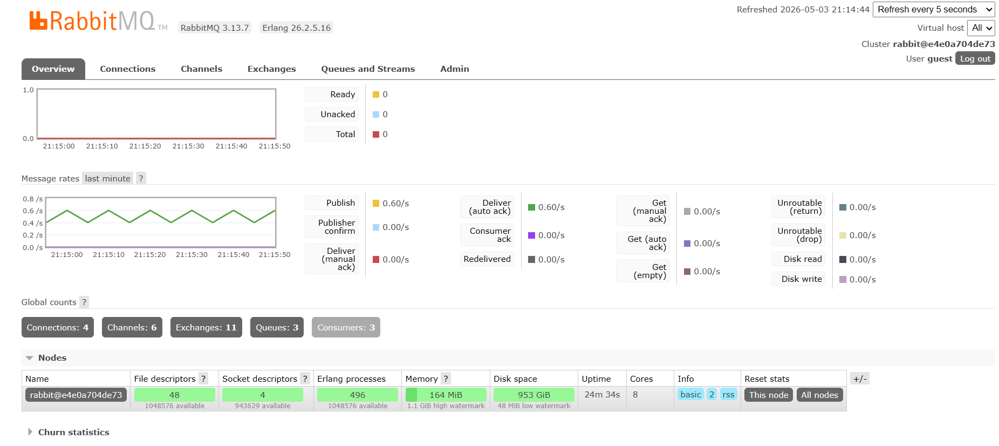
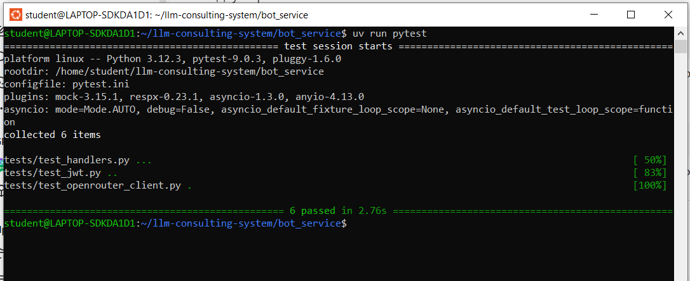
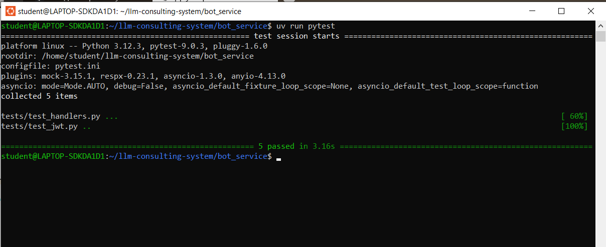
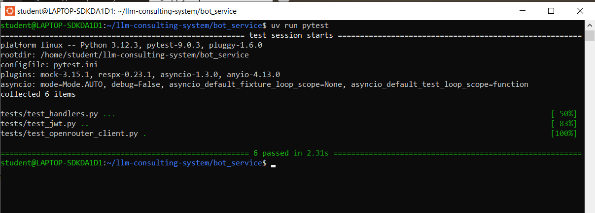

# LLM Consulting System

## 📌 Описание проекта

Проект представляет собой двухсервисную систему для работы с LLM (Large Language Model) с использованием JWT-аутентификации и асинхронной обработки запросов.

Система состоит из:

- Auth Service — регистрация пользователей, логин и выпуск JWT
- Bot Service — Telegram-бот, принимающий запросы пользователей и отправляющий их в LLM через очередь

Сервисы полностью изолированы и взаимодействуют только через JWT.

---

## 🏗 Архитектура системы

### Auth Service
- Регистрация пользователя
- Хеширование пароля (bcrypt)
- Логин и выдача JWT
- Проверка токена
- Endpoint /auth/me

### Bot Service
- Принимает JWT от пользователя
- Валидирует токен (подпись + срок)
- Сохраняет токен в Redis
- Принимает сообщения из Telegram
- Публикует задачи в RabbitMQ
- Не выполняет запрос к LLM напрямую

### Асинхронная обработка
- Bot Service → отправляет задачу
- RabbitMQ → очередь сообщений
- Celery Worker → обрабатывает задачу
- OpenRouter API → получает ответ LLM

---

## ⚙️ Технологии

- Python 3.12
- FastAPI
- SQLAlchemy (async)
- SQLite
- JWT (python-jose)
- Passlib (bcrypt)
- Aiogram
- Redis
- RabbitMQ
- Celery
- HTTPX
- Pytest
- Fakeredis
- Pytest-mock
- Respx

---

## 🚀 Запуск проекта

git clone https://github.com/AndreyAU/llm-consulting-system.git  
cd llm-consulting-system  
docker compose up --build  

---

## 🔐 API Auth Service

- POST /auth/register — регистрация  
- POST /auth/login — получение JWT  
- GET /auth/me — данные пользователя по токену  

Swagger:  
http://127.0.0.1:8000/docs  

---

## 🤖 Сценарий работы Telegram-бота

1. Пользователь запускает бота (/start)  
2. Отправляет JWT: /token <JWT>  
3. Бот сохраняет токен в Redis  
4. Пользователь отправляет запрос  
5. Бот валидирует JWT  
6. Бот отправляет задачу в RabbitMQ  
7. Celery Worker обрабатывает задачу  
8. Ответ возвращается пользователю  

---

## 🧪 Тестирование

### Auth Service

Модульные тесты:
- hash_password
- verify_password
- create_access_token
- decode_token

Интеграционные тесты:
- регистрация
- логин
- /auth/me

Негативные тесты:
- повторная регистрация → 409
- неверный пароль → 401
- нет токена → 401
- неверный токен → 401

---

### Bot Service

Модульные тесты:
- проверка JWT
- обработка ошибок

Мок-тесты:
- fakeredis
- pytest-mock

Проверяется:
- сохранение токена
- отказ без токена
- вызов Celery

Интеграционные тесты:
- respx
- проверка OpenRouter

---
## 📸 Скриншоты

### Swagger Auth Service

### Регистрация

### Логин

### /auth/me

### Тесты Auth

---

### Telegram Bot (workflow)

---

### RabbitMQ (очереди и активность)

---

### Тесты Bot Service (общие)

---

### Тесты обработчиков (handlers)

---

### Полный прогон тестов Bot Service

---

## 🔑 Пример пользователя

andreenko@email.com

---

## 📊 Соответствие требованиям

✔ Разделение на два сервиса  
✔ JWT создаётся только в Auth Service  
✔ Bot Service валидирует токен  
✔ Redis используется  
✔ RabbitMQ используется  
✔ Celery используется  
✔ Асинхронная обработка реализована  
✔ Тесты реализованы и проходят  
✔ Все сценарии подтверждены скриншотами  

---

## 📎 Примечания

JWT содержит:
- sub
- role
- iat
- exp

Пароли хешируются и не хранятся в открытом виде.

---

## 👨‍💻 Автор

Andreenko
